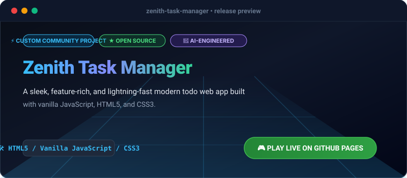

# Zenith Task Manager

[](https://olamideakinade.github.io/zenith-task-manager/)
[](https://github.com/Olamideakinade/zenith-task-manager)
[](https://opensource.org/licenses/MIT)



> 🚀 **Live Demo Available:** Test and play this project live right now: **[https://olamideakinade.github.io/zenith-task-manager/](https://olamideakinade.github.io/zenith-task-manager/)**

A sleek, modern, feature-rich task manager built with **HTML5, Vanilla JavaScript (ES6+), and CSS3**. Zenith helps you organize your daily life, track productivity metrics, filter tasks efficiently, and keep your workflow blazing fast.

## ✨ Key Features (v1.1.0)

- **🎯 Comprehensive Task Management**: Create, edit, complete, and delete tasks with priorities (Low, Medium, High, Urgent), categories, and due dates.
- **📊 Productivity Analytics**: Live metrics dashboard tracking completion rate and category distributions.
- **🌓 Dark & Light Themes**: Seamless theme switching with persistent local storage.
- **🔍 Instant Search & Filtering**: Filter by category, status, priority, or search keywords instantly.
- **💾 Data Export/Import**: Backup your tasks to JSON or restore existing archives.
- **🎨 Modern Glassmorphism & UI**: Crafted with smooth transitions, custom scrollbars, and gorgeous responsive layouts.

## 🛠️ Built With

- **HTML5** (Semantic Markup)
- **CSS3** (Variables, Flexbox, Grid, Glassmorphism effects)
- **Vanilla JavaScript (ES6+)** (DOM Manipulation, LocalStorage API, Event Delegation)
- **Google Fonts** (Inter)

## 🚀 Getting Started Locally

1. Clone the repository:
   ```bash
   git clone https://github.com/Olamideakinade/zenith-task-manager.git
   ```
2. Open the project folder:
   ```bash
   cd zenith-task-manager
   ```
3. Open `index.html` in your favorite modern browser or launch via Live Server (VS Code).

## 📜 License

Distributed under the MIT License. See `LICENSE` for more information.
